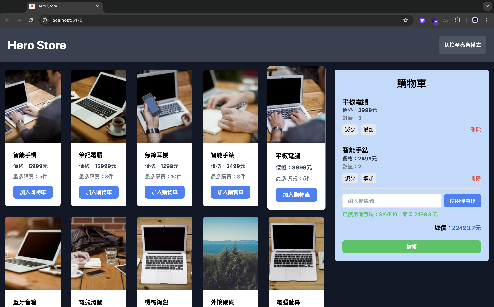

# Hero Store

這個專案是一個簡單練習 Vue3 框架的好題目，為了在短時間內完成，有透過外力（GPT）幫忙，但我還是有回去掌握全部的技術是如何運作的，並透過更改一些邏輯與樣式實踐自己是否真正學會，目前還在持續精進，每天堅持實作練習，讓自己輸出最大化，必須得說還有非常多東西要學習，努力成為一個學以致用的阿祥！



## 專案設置

```sh
npm install 安裝

npm run dev 開發

npm run build 壓縮打包

npm run lint 代碼檢查

```

## 實現思路

深色模式：允許使用者切換亮色和深色模式，儲存於 localStorage 中，當用戶重新訪問時，根據上次的選擇自動應用。

購物車功能：購物車使用 Pinia 管理狀態，包括商品數量、總金額、折扣等狀態。

折扣碼：有分百分比折扣與固定金額折扣，使用者可以輸入折扣碼進行驗證，折扣會套用到購物車的總價中。

## 使用的主要技術

- **Vue 3**：作為前端應用的主框架，用於構建單頁應用程序。
- **Vite**：作為快速開發和打包工具，支持高效的開發環境和構建速度。
- **Pinia**：Vue 3 的狀態管理工具，用於管理應用中的狀態（例如購物車的狀態）。
- **Tailwind CSS**：CSS 框架，用於響應式設計，並且支援深色模式（Dark Mode）。
- **SweetAlert2**：顯示互動式的彈窗，提供簡單的通知、確認和錯誤訊息。
- **localStorage**：保存使用者的主題偏好（亮色或深色模式），在重新載入時保持一致。

## 遇到的挑戰和解決方案

目前還沒想到
